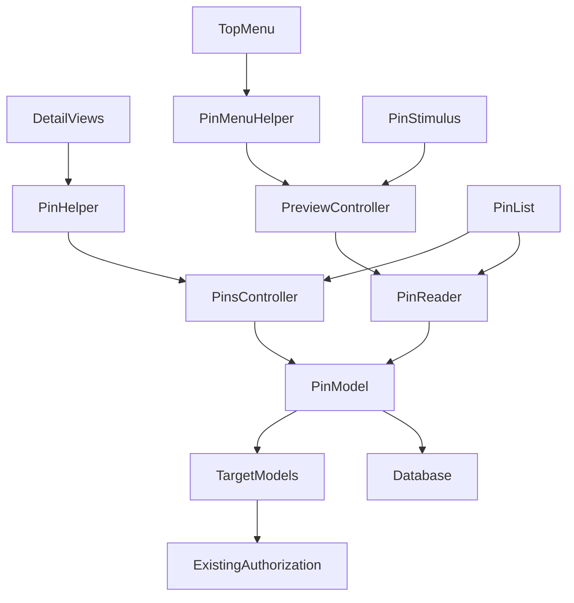
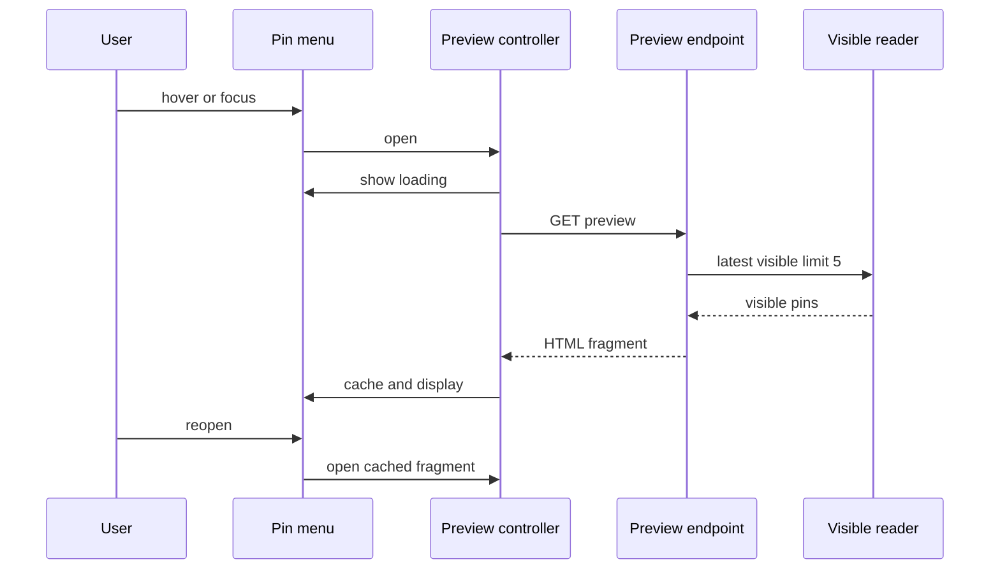
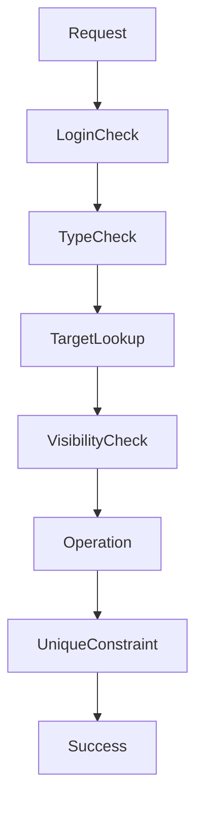
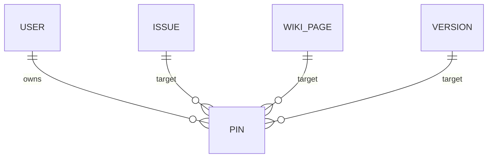

# Technical Design: personal-pins

## Overview

本機能は、ログインユーザーがチケット、Wikiページ、バージョンを個人用にピン留めし、最近使った対象へ一覧またはトップメニューのプレビューから再訪できるようにする。既存の`Pin`ポリモーフィックモデルとRedmineの認可を拡張し、通知・Watcherとは独立したナビゲーション機能として維持する。

通常画面の初期描画ではピン対象を読み込まない。デスクトップのhoverまたはfocus後に専用HTMLエンドポイントを一度だけ取得し、小画面では既存flyout内の通常リンクとして一覧へ遷移する。

### Goals

- 3種類の対象を詳細画面から追加・解除し、現在の権限に従って表示する
- 一覧と最大5件の遅延プレビューを最近ピン留めした順に提供する
- 重複追加・反復解除・JavaScript不使用時にも安全な操作契約を提供する
- 通常画面の初期描画へピン取得コストや障害を持ち込まない

### Non-Goals

- 通知、Watcher、優先順位、担当状態との連携
- 共有ピン、手動並び替え、分類、管理画面、外部API
- ロードマップ上のバージョン操作、対象側の既存認可ロジック変更
- プレビュー内容のサーバー共有キャッシュまたはバックグラウンド同期

## Boundary Commitments

### This Spec Owns

- `pins`レコードの所有権、一意性、最近順、および3種類の許可対象
- 対象identityによる追加・解除の冪等なHTML/JS操作契約
- 閲覧可能なピンだけを返す一覧・プレビュー読み取り境界
- 詳細画面の操作、トップメニュー導線、プレビュー状態と英日文言

### Out of Boundary

- Issue、WikiPage、Version、Projectの閲覧可否判定そのもの
- Redmine共通メニュー・flyout・Stimulusローダーの一般仕様
- 対象削除をPin側から制御すること、および孤児レコードの管理UI
- 他機能が所有する通知、購読、プロジェクトブックマーク

### Allowed Dependencies

- `User.current`、`require_login`、各対象の`visible?`、既存path helper
- Active Record、DB複合一意制約、Redmine MenuManager
- Rails UJSのremote応答と通常HTMLフォーム、Stimulus/importmap
- 既存responsive flyoutとCSS breakpoint。新規外部依存は禁止する
- 依存方向は `対象モデルと認可 → Pin読み取り・書き込み → Controller/Helper → View/Stimulus` とし、対象モデルはプレビューUIへ依存しない

### Revalidation Triggers

- 対応対象種別、Pin identity、ルートまたはHTML fragment契約の変更
- `visible?`またはVersion共有可視性の意味変更
- top menu DOM、responsive flyout移送方式、Stimulusロード方式の変更
- `pins`の所有権・一意制約・並び順の変更

## Architecture

### Existing Architecture Analysis

- `Pin`、`PinsController`、一覧、Issue/Wiki詳細操作、DB一意制約を拡張する。
- 認可は対象モデルの`visible?(User.current)`を唯一の判定元とし、不可視化でPinを削除しない。
- 標準MenuManagerは`li`の専用wrapperを表現できないため、メニュー列挙は維持し、`:pinned_items`だけをlayout helperで専用レンダリングする。
- 現在の全件Ruby filterは一覧では互換性を保てるが、プレビューではキーセット・バッチ読み取りへ分離する。

### Architecture Pattern & Boundary Map



**Architecture Integration**:

- 選択パターン: 既存CRUD拡張と専用遅延プレビューを組み合わせるハイブリッド
- 境界: 書き込みは`PinsController`、可視読み取りは`Pin::VisibleReader`、表示変換はhelper、クライアント状態はStimulusが所有する
- 既存パターン: MenuManager、HTML partial、UJS、`visible?`、responsive DOM移送を維持する
- 新規要素: preview action、可視読み取りクラス、専用menu helper、Stimulus controllerだけを追加する
- Steering: `.kiro/steering/`が空のため、既存Redmine規約を基準とする

### Technology Stack

| Layer | Choice / Version | Role in Feature | Notes |
|---|---|---|---|
| Frontend | Rails ERB、Stimulus、Rails UJS | 詳細操作、遅延preview、同一ページキャッシュ | 既存importmapを使用 |
| Backend | Rails MVC / Active Record | 認証、冪等CRUD、可視読み取り | 新規gemなし |
| Data | 既存Redmine DB / `pins` | userとpolymorphic対象の関係 | 複合unique indexを整合性の最終境界とする |
| Runtime | Redmine MenuManager / responsive.js | top menu順序とmobile flyout | 初期preview requestなし |

## File Structure Plan

### New Files

```text
app/
├── models/pin/visible_reader.rb              # 可視な最近順読み取り
├── helpers/pin_menu_helper.rb                # pinned_items専用menu wrapper
├── javascript/controllers/pin_preview_controller.js # hover focus fetch状態
├── views/pins/_preview.html.erb              # 最大5件fragment
└── assets/stylesheets/pins.css               # desktop previewと状態表示
test/
├── unit/pin/visible_reader_test.rb
├── unit/helpers/pin_menu_helper_test.rb
└── system/personal_pins_test.rb
```

### Modified Files

- `app/models/pin.rb` — Version許可、一意性・最近順・可視性契約
- `app/models/user.rb`、`app/models/issue.rb`、`app/models/wiki_page.rb`、`app/models/version.rb` — 関連と対象削除時cleanup
- `app/controllers/pins_controller.rb` — index、preview、対象identityベースの冪等create/destroy
- `app/helpers/pins_helper.rb` — 3種類のpath/label/typeと通常フォーム操作
- `app/views/pins/index.html.erb`、`_pin.html.erb`相当 — 一覧と解除表示
- `app/views/pins/create.js.erb`、`destroy.js.erb` — toggle更新とpreviewキャッシュ失効通知
- `app/views/issues/show.html.erb`、`app/views/wiki/show.html.erb`、`app/views/versions/show.html.erb` — 詳細画面だけに操作を配置
- `app/views/layouts/base.html.erb` — top menuの専用レンダリング入口とstylesheet
- `lib/redmine/preparation.rb` — account menuから削除しMy page直後へ登録
- `config/routes.rb` — previewと対象identity destroy route
- `config/locales/en.yml`、`config/locales/ja.yml` — Version、loading、empty、error文言
- `test/fixtures/pins.yml`、`test/unit/pin_test.rb`、`test/functional/pins_controller_test.rb`、`test/unit/lib/redmine_test.rb` — domain/controller/menu回帰

## System Flows



小画面ではcontrollerが`isMobile`相当の既存判定を使ってopen/fetchを行わず、リンクclickを妨げない。取得失敗はpreview領域だけをerror状態へ変更する。



createはunique競合を既存レコードとして成功扱いにする。destroyは`pinnable_type`と`pinnable_id`で現在ユーザーのscopeだけを`delete_all`し、0件でも成功する。

## Requirements Traceability

| Requirement | Summary | Components | Interfaces | Flows |
|---|---|---|---|---|
| 1.1, 1.2, 1.3, 1.4 | 個人所有とログイン | PinsController, Pin | CRUD API | write flow |
| 2.1, 2.2, 2.3 | 3種の詳細追加 | PinsHelper, DetailViews, PinsController | POST pins | write flow |
| 2.4, 2.5, 2.6 | 認可・対象制限・roadmap除外 | PinsController, Pin, DetailViews | target resolution | write flow |
| 3.1, 3.2, 3.3, 3.4 | 詳細/一覧の冪等解除 | PinsHelper, PinsController | DELETE pin identity | write flow |
| 4.1, 4.7 | My page直後の一覧導線 | PinMenuHelper, MenuManager | GET pins | navigation |
| 4.2, 4.3, 4.4, 4.5, 4.6 | 最近順一覧と再訪 | VisibleReader, PinList | list state | read flow |
| 4.8, 4.9, 4.10, 4.11, 4.12, 4.13 | 最大5件previewと状態 | PinPreviewController, PreviewController, PreviewPartial | GET preview fragment | preview flow |
| 5.1, 5.2, 5.3, 5.4 | 不可視保持と孤児除外 | VisibleReader, Pin | read contract | read flow |
| 5.5, 5.6, 5.7 | 現在情報と既存認可 | VisibleReader, TargetModels | visible? | read flow |
| 6.1, 6.2 | 並行・反復操作 | PinsController, DB index | POST/DELETE | write flow |
| 6.3, 6.4 | HTML fallbackと英日表示 | PinsHelper, Locales | HTML responses | write/navigation |
| 6.5 | mobile通常導線 | PinPreviewController, responsive flyout | GET pins | navigation |
| 6.6, 6.7 | 初期描画と障害隔離 | PinPreviewController, PreviewController | lazy GET | preview flow |

## Components and Interfaces

| Component | Domain/Layer | Intent | Req Coverage | Key Dependencies | Contracts |
|---|---|---|---|---|---|
| Pin | Domain/Data | 所有関係と対象種別の不変条件 | 1.1, 1.4, 2.5, 5.2, 6.1 | DB P0, target models P0 | State |
| VisibleReader | Domain/Read | 現在閲覧可能な最近順Pinを返す | 4.2, 4.8, 5.1, 5.2, 5.3, 5.4, 5.5, 5.6, 5.7 | Pin P0, visible? P0 | Service |
| PinsController | Web | 認証済みCRUDとpreview応答 | 1.2, 1.3, 2.2, 2.3, 2.4, 2.5, 3.2, 3.3, 3.4, 6.1, 6.2, 6.3 | Pin P0, VisibleReader P0 | API |
| PinsHelper | Presentation | 3種類の表示情報と操作を生成 | 2.1, 2.3, 3.1, 3.3, 4.3, 4.4 | routes P0 | Service |
| PinMenuHelper | Navigation | top menu項目だけにpreview wrapperを与える | 4.1, 4.7, 6.5 | MenuManager P0 | Service |
| PinPreviewController | Client UI | desktopのopen/fetch/cache/errorを管理 | 4.8, 4.9, 4.10, 4.11, 4.12, 4.13, 6.5, 6.6, 6.7 | Stimulus P0 | State |
| Pin views | Presentation | 一覧・fragment・詳細toggleを表示 | 2.1, 3.1, 4.3, 4.4, 4.5, 6.4 | helpers P0 | State |

### Domain / Read Layer

#### VisibleReader

| Field | Detail |
|---|---|
| Intent | user scopeから閲覧可能なPinを最近順に返す |
| Requirements | 4.2, 4.8, 5.1, 5.2, 5.3, 5.4, 5.5, 5.6, 5.7 |

**Responsibilities & Constraints**

- `call(limit: nil)`は全一覧、`call(limit: 5)`はpreviewを表す。
- `(created_at, id)`の降順キーセットで一定件数ずつ読み、5件に達するかscopeを尽くすまで継続する。固定走査上限で正しい5件を欠落させない。
- batchごとにpinnableとproject関連を型別に先読みし、各対象の`visible?(user)`を評価する。
- 不可視・削除済み対象は返さずPin自体も変更しない。返却値は`Array<Pin>`で最近順を維持する。

**Dependencies**

- Inbound: PinsController — 一覧/preview取得 (P0)
- Outbound: Pin、Issue、WikiPage、Version — current stateと認可 (P0)

**Contracts**: Service [x]

```ruby
Pin::VisibleReader.new(user).call(limit: Integer | nil) # => Array<Pin>
```

- Preconditions: userはログイン済み、limitはnilまたは正整数
- Postconditions: 全要素は現時点でvisible、最近順、limit以下
- Invariants: 読み取りはPinを削除・更新しない

### Web Layer

#### PinsController

| Field | Detail |
|---|---|
| Intent | Pinの所有者境界、対象解決、冪等操作、読み取り応答を提供する |
| Requirements | 1.1, 1.2, 1.3, 2.2, 2.4, 2.5, 3.2, 3.4, 4.2, 4.8, 6.1, 6.2, 6.3, 6.6, 6.7 |

**Contracts**: API [x]

| Method | Endpoint | Request | Response | Errors |
|---|---|---|---|---|
| GET | `/pins` | none | full HTML list | unauthenticated redirect |
| GET | `/pins/preview` | none | HTML fragment, max 5 | 401/500; caller isolates |
| POST | `/pins` | `pinnable_type`, `pinnable_id` | JS toggle or redirect | 404 invalid/missing, 403 invisible |
| DELETE | `/pins` | `pinnable_type`, `pinnable_id` | JS toggle or redirect | 404 invalid type; missing own pin succeeds |

**Responsibilities & Constraints**

- 許可型は定数照合後に解決し、未検証文字列をconstantizeしない。
- createは対象visible確認後、複合unique違反を再検索して成功へ収束させる。
- destroyは現在ユーザーscopeだけを削除し、他ユーザーのPin有無を応答へ反映しない。
- JS成功応答は詳細toggleを更新し、`pin-preview:invalidate`をdispatchする。HTMLは安全なfallbackへredirectする。

### Navigation / Client Layer

#### PinPreviewController

| Field | Detail |
|---|---|
| Intent | previewの表示ライフサイクルを通常ページから隔離する |
| Requirements | 4.8, 4.9, 4.10, 4.11, 4.12, 4.13, 6.5, 6.6, 6.7 |

**Contracts**: State [x]

- 状態: `idle → loading → loaded | empty | error`。取得済みHTMLはcontroller instance内に保持する。
- pointer enterとfocus inでdesktopのみopenする。pointer leaveとfocus outは内部移動を除いてcloseし、Escapeでもcloseする。
- 親リンクclickは常に`/pins`へ遷移可能。preview itemは対象URLへ直接遷移する。
- `pin-preview:invalidate`で`idle`へ戻し、次回open時だけ再取得する。
- disconnect時にlistenerと進行中fetchを破棄する。

**Implementation Notes**

- mobile判定は既存flyout toggleの可視性と同じ契約を再利用する。
- loadingは静的DOM、empty/successはserver fragment、errorはlocalized data valueで表示する。
- fragmentはユーザー入力をERB escapeし、URLは対象別helperのみで生成する。

## Data Models

### Domain Model



- aggregate rootはUser配下のPin。対象は参照先でありPin transactionの所有物ではない。
- identityは`user_id, pinnable_type, pinnable_id`。同一identityは最大1件。
- 並び順は`created_at DESC, id DESC`。解除後の再作成は新しい時刻で先頭になる。
- 対象側の通常削除は`dependent: :delete_all`でcleanupするが、読み取りは孤児にも耐える。

### Logical Data Model

既存`pins`表を継続利用し、schema変更は不要。`user_id`とpinnable identityはNOT NULL、複合unique indexを競合制御の最終境界とする。polymorphic対象へのDB外部キーは設けず、User外部キーと対象側callback、読み取り時存在確認で整合性を保つ。

## Error Handling

- 未ログインは既存`require_login`、不正種別・不存在は404、不可視対象のcreateは403とする。
- duplicate createとmissing own destroyは成功へ正規化する。
- preview失敗はfragment領域だけに英日エラーを表示し、ページと親リンクを変更しない。
- 対象削除・権限例外はVisibleReaderで不可視として扱い、一覧全体を失敗させない。予期しない例外は通常のRailsログへ記録する。

## Security and Privacy

- すべてのendpointをログイン必須とし、書き込みは`User.current.pins`からのみ行う。
- target identityを許可リスト検証し、create前に既存`visible?`を評価する。
- 一覧/previewは認可後の名称・project・URLだけをrenderし、不可視対象のmetadataやPin存在を出力しない。
- CSRF保護を既存Railsフォーム/UJSで維持する。GET previewは読み取り専用とする。

## Performance and Scalability

- base layoutはPin relation、preview partial、対象を問い合わせない。preview fetchはdesktop hover/focus後だけ開始する。
- previewはキーセット・バッチ走査により全件materializeを避け、可視5件に達した時点で停止する。不可視Pinが連続する場合は正確性を優先して次batchを読む。
- 型別preloadでtarget/projectのN+1を防止する。system/integration testで初期GETにpreview requestがないこと、reader testでbatch境界を検証する。
- 同一ページの再openは追加requestなし。追加・解除後だけcacheを失効する。

## Testing Strategy

### Unit

- `PinTest`: 3種許可、identity一意性、最近順、対象削除、通知等を変更しないこと（1.4, 2.5, 4.6, 6.1）
- `VisibleReaderTest`: 最近順、5件、batchを跨ぐ不可視列、権限喪失/回復、孤児、現在名称、closed/locked Version、closed project、共有Version所有project不可視（4.2, 4.8, 5.1, 5.2, 5.3, 5.4, 5.5, 5.6, 5.7）
- helper tests: 3種のpath/label/type、top menu wrapperと通常項目順（2.1, 4.1, 4.3, 4.4）

### Functional / Integration

- 未ログイン、他人非開示、不正型、不可視create、3種create/destroy、HTML redirect、JS toggle（1.1, 1.2, 1.3, 2.2, 2.3, 2.4, 2.5, 3.2, 3.3, 3.4, 6.3）
- unique競合を注入したcreateと0件destroyが成功し最終件数0/1になること（6.1, 6.2）
- preview fragmentの最大5件、recent order、直接link、empty、英日文言、障害時endpoint分離（4.8, 4.9, 4.10, 4.11, 4.12, 6.4, 6.7）
- MenuManagerでMy page直後、account menuから除外、guest非表示（4.1, 4.7）

### System / E2E

- Issue、Wiki、Version詳細でpin→即時unpin表示、一覧遷移、再pinで先頭（2.1, 2.2, 2.3, 3.1, 3.2, 3.3, 4.6）
- roadmapにVersion操作がないこと（2.6）
- hover/focusのloading→success、direct navigation、Escape/leave、再open時no refetch、失敗表示（4.8, 4.9, 4.10, 4.11, 4.12, 4.13）
- small viewportでflyoutの導線clickがpreviewなしで一覧へ遷移（6.5）
- JavaScript無効相当のHTML requestで追加・解除・一覧が成立（6.3）
- 通常ページ初期表示にpreview requestが発生せず、preview障害でも画面操作可能（6.6, 6.7）

## Migration and Rollout

- 既存migrationとPinデータを利用し、追加migrationは不要。
- deploy順序はdomain/helper/controller、routes/views/locales/assets、tests。asset manifestは通常のRedmine手順で更新する。
- rollout後は404/403、unique競合回収、preview 5xxとreader batch数をログで確認する。feature flagは追加しない。

## Risks and Mitigations

- 不可視Pinが大量に先行するとpreview query数が増える。キーセットbatchとpreloadでmemory/N+1を抑え、計測可能にする。
- responsive.jsが`ul`を移送するためStimulus再接続に依存できない。controller wrapperも`li`と共に移送される構造にする。
- MenuManager共通render変更は回帰範囲が広い。専用helperで`:pinned_items`だけを分岐する。
- DBごとのunique例外差はActive Record例外を境界で正規化し、複数adapterテスト方針に従う。
